### Gray Code:
The Gray code is unweighted code. Gray code exhibits only a single bit change from one code word to the next in sequence. Due to this specific feature Gray code is important in applications such as shaft position encoders, where error susceptibility increases with the number of bit changes between adjacent numbers in a sequence.

 

#### Let us design a 3-bit Gray to Binary code converter and implement using IC-74LS138.

#### The relation between these two codes can be understood from the following diagram and equations:

 
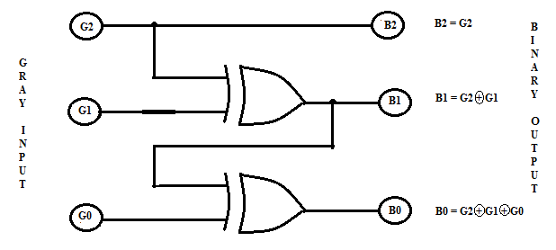
 

#### Fig. 1. Gray Code to Binary Conversion
 

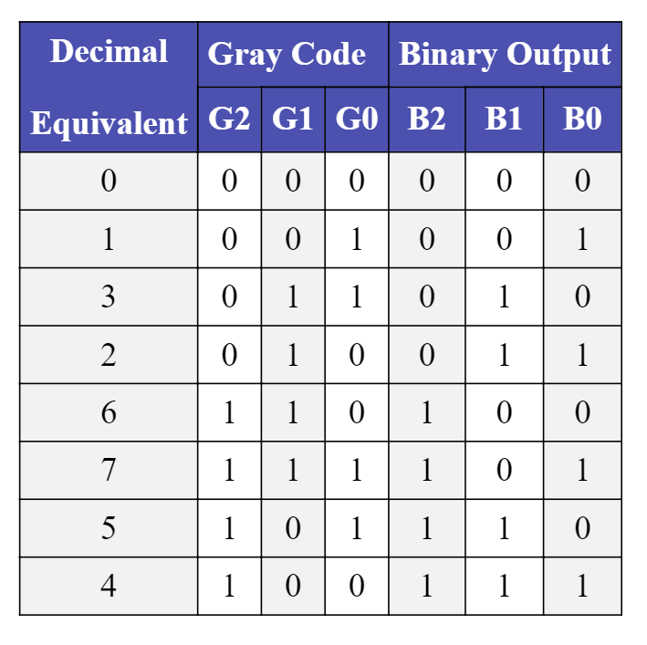

From the truth table it is observed that the output B2 is HIGH for minterms m4, m5, m6 and m7. Hence equation defining B2 output can be written as: B2 = &Sigma; m (4, 5, 6, 7). The output B1 is HIGH for minterms m2 and m3 m4 &amp; m5. Hence equation defining B1 output can be written as: B1 = &Sigma; m (2, 3, 4, 5). The output B0 is HIGH for minterms&nbsp; m1, m2&nbsp; m4 m7. Hence equation defining B0 output can be written as: B0 = &Sigma; m (1, 2, 4, 7). The Binary outputs for given 3 bit Gray code are summarized as follows:

B2 = &Sigma; m (4, 5, 6, 7)

B1 = &Sigma; m (2, 3, 4, 5)

B0 = &Sigma; m (1, 2, 4, 7)

These equations can be implemented by using IC74LS138 as a 3:8 decoder as shown in Fig.2. Every Binary output has 4-minterms each. Hence IC74LS20- four input NAND gate ICs are required to produce the final Binary equivalent.

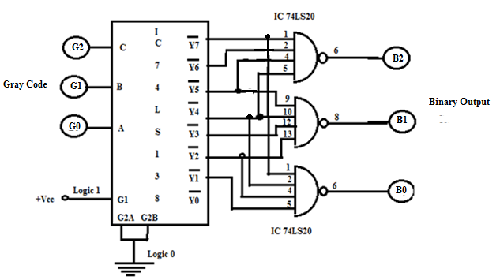
 
Fig.2. Implementation of Gray code to Binary Converter using IC 74LS138 Decoder 

<b>Note:</b> The outputs of IC 74138 are active low.

The logic diagram, connection diagram and function table for IC 74LS138 are given below:

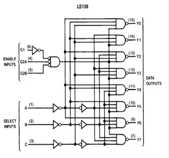
 
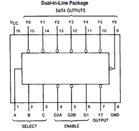
 
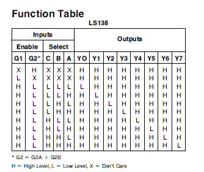
 

Fig.3. Logic Diagram, Connection Diagram &amp; Function Table of IC 74LS138.

#### Numerical:

 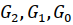   Outputs =&gt; 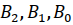
   
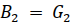
 
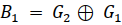
 
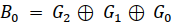
 
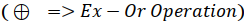
 
 
Ex-Or Operation Table:
 

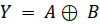
 
Truth table:

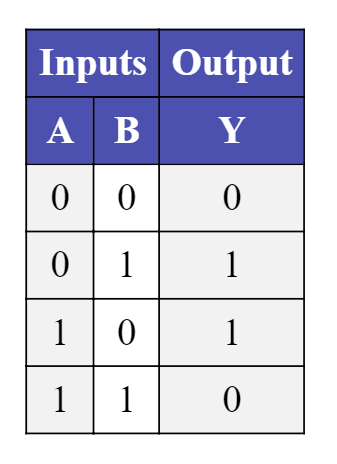

Examples: 
<ol>
	<li>
		Input &ldquo;011&rdquo; 
		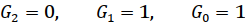
		 
		 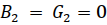
		 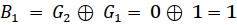
		 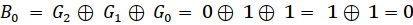
		 Output &ldquo;010&rdquo;   
	</li>
	<li>
		Input &ldquo;110&rdquo; 
		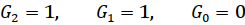
		 
		 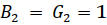
		 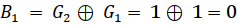
		 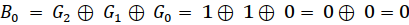
		 Output &ldquo;100&rdquo;   
	</li>
	<li>
		Input &ldquo;111&rdquo; 
		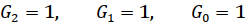
		 
		 
		 
		 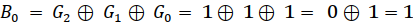
		 Output &ldquo;101&rdquo;   
	</li>
</ol>
